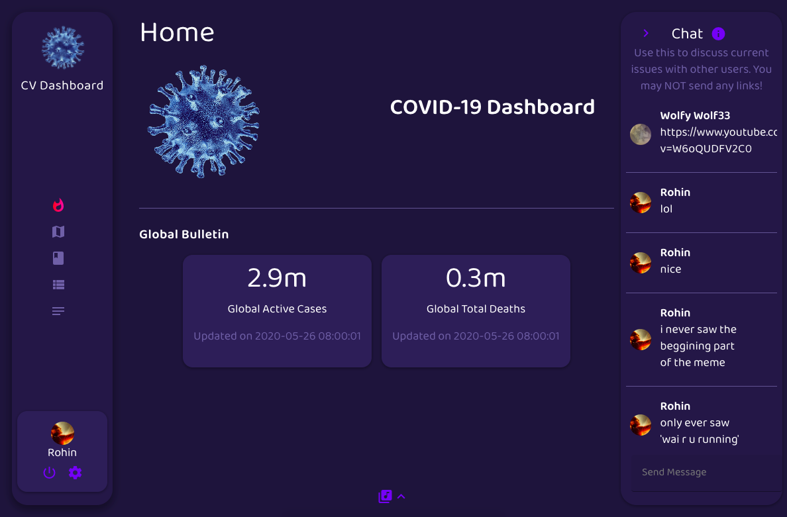
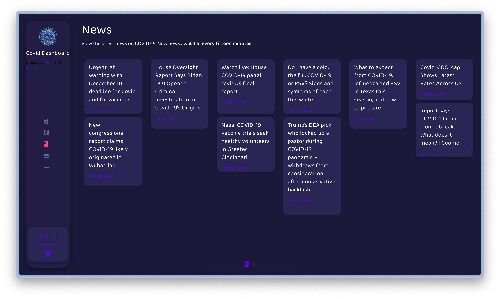

# COVID Dashboard

This is @TheRealJohnLiu and @r0hin COVID Dashboard, which we made in May 2020 for our Y9 Design assignment. It features live stats, a map, news feed, and a chat/user system with pinned countries and stats.

You can read our full writeup [here](https://github.com/r0hin/covid-dashboard/wiki). It's unlikely these features will remain working, so here are a few screenshots:

